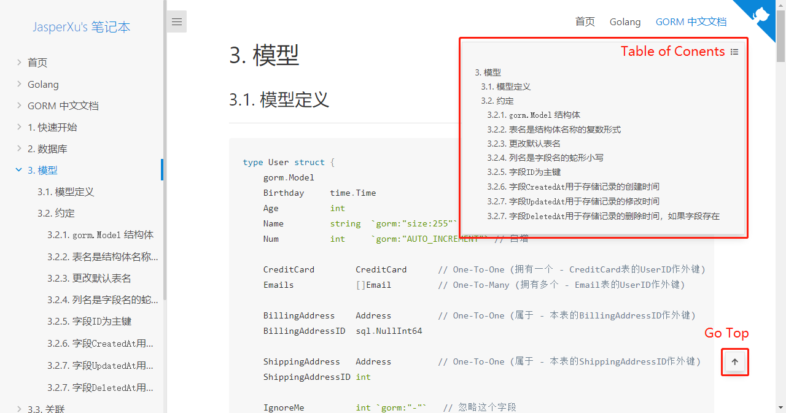
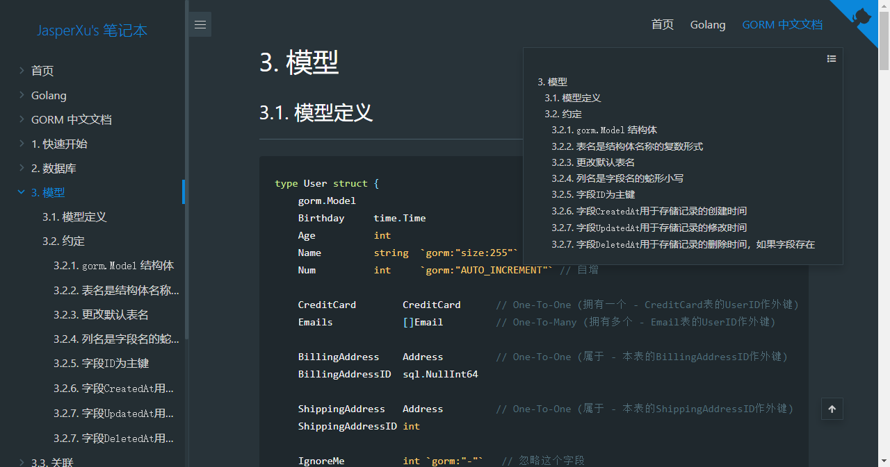

# Docsify Table of Contents & Go Top

[Demo](http://jasperxu/#/Programming/Golang/GORM/)

Two icons are fixed on the right side of the Page. 

Move on it Show the Table of Contents, and the other will return to the top of the page after clicking.

**Need fontawesome-free**

**Support docsify-themeable**





## To Use

Add stylesheet

```html
<link rel="stylesheet" href="https://cdn.jsdelivr.net/npm/@fortawesome/fontawesome-free/css/fontawesome.css">
<link rel="stylesheet" href="https://cdn.jsdelivr.net/npm/@fortawesome/fontawesome-free/css/solid.css">
<link rel="stylesheet" href="https://cdn.jsdelivr.net/npm/docsify-jx-toc/dist/jx-toc.css">
```

Add JS

```html
<script src="https://cdn.jsdelivr.net/npm/docsify-jx-toc/dist/jx-toc.js"></script>
```

Add settings

```js
window.$docsify = {
  jxtoc: {
      headings: "h1, h2, h3, h4, h5, h6",
  },
}
```


# Docsify 目录和回到顶部

[示例](http://jasperxu/#/Programming/Golang/GORM/)

页面右侧添加2个图标按钮。

鼠标移动到上面会显示目录，另一个点击后回到页面顶部。

**需要引用fontawesome-free**

**支持docsify-themeable**

## 使用

添加样式

```html
<link rel="stylesheet" href="https://cdn.jsdelivr.net/npm/@fortawesome/fontawesome-free/css/fontawesome.css">
<link rel="stylesheet" href="https://cdn.jsdelivr.net/npm/@fortawesome/fontawesome-free/css/solid.css">
<link rel="stylesheet" href="https://cdn.jsdelivr.net/npm/docsify-jx-toc/dist/jx-toc.css">
```

添加js

```html
<script src="https://cdn.jsdelivr.net/npm/docsify-jx-toc/dist/jx-toc.js"></script>
```

添加设置

```js
window.$docsify = {
  jxtoc: {
      headings: "h1, h2, h3, h4, h5, h6",
  },
}
```

